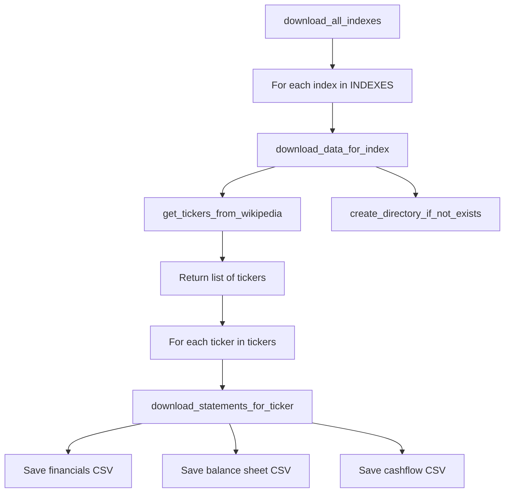

## Mermaid diagram data_loader.py

```mermaid
flowchart TD
    A["download_all_indexes"] --> B["For each index in INDEXES"]
    B --> C["download_data_for_index"]
    C --> D["get_tickers_from_wikipedia"]
    C --> E["create_directory_if_not_exists"]
    D --> F["Return list of tickers"]
    F --> G["For each ticker in tickers"]
    G --> H["download_statements_for_ticker"]
    H --> I["Save financials CSV"]
    H --> J["Save balance sheet CSV"]
    H --> K["Save cashflow CSV"]
```